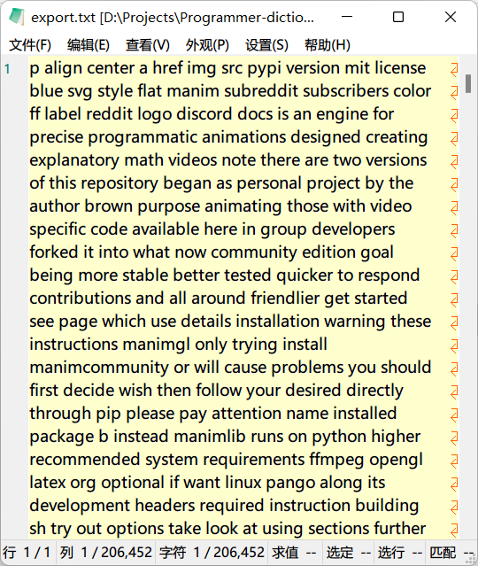
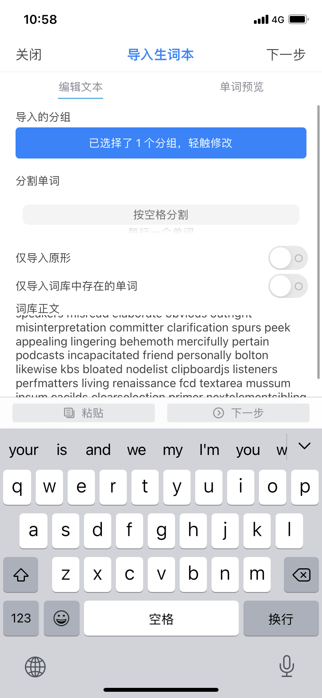
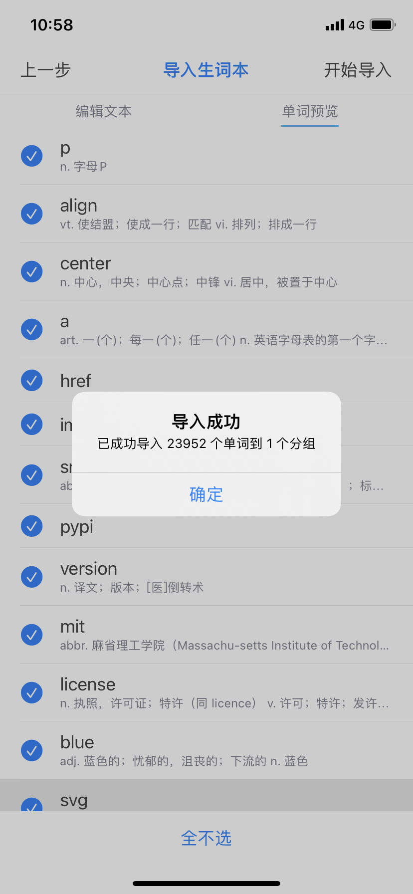

# Programmer-dictionary
程序员词典 - Python爬取GitHub仓库README.md内的单词并分析出词库

根索引：GitHub-English-Top-Charts中的 All-Language.md

直接使用：`export.txt`（空格分隔）和`data\words.txt`（按行分隔），两个内容一样。是我最终处理后获得的文件，可以直接拿来给你的软件导入词库

手动更新：

1. 下载文件

   ```bash
   git clone https://github.com/BigTear/Programmer-dictionary.git
   cd Programmer-dictionary
   ```
   
2. 配置Python

   创建虚拟环境

   ```bash
   python -m venv env
   ```
   
   激活虚拟环境
   
   - Windows cmd:

       ```bash
       env\Scripts\activate.bat
       ```
   
   - Other system:

       ```bash
       source env/bin/activate
       ```
   
   安装依赖
   
   ```bash
   pip install -r requirements.txt
   ```
   
3. 执行
   
   ```bash
   # 按需修改update.py内全局设置（默认不需要更改）后执行update.py更新所有readme并保存到data目录下
   python update.py 
   # 处理所有获取的md文件并保存单词到data目录下words.txt（按行分隔）
   python process.py
   # 导出words.txt为按空格分隔
   python export.py
   ```

4. 导入效果（导入欧路词典后）

   
   
   
   
   


解释程序流程：

update.py :

1. 获取[GitHub-English-Top-Charts的 All-Language.md

   https://github.com/GrowingGit/GitHub-English-Top-Charts/blob/main/content/charts/overall/software/All-Language.md

2. 转换为raw文件地址

   https://github.com/GrowingGit/GitHub-English-Top-Charts/raw/main/content/charts/overall/software/All-Language.md 

   -->

   https://raw.githubusercontent.com/GrowingGit/GitHub-English-Top-Charts/main/content/charts/overall/software/All-Language.md

3. 提取所有列出的仓库的名称和链接，如：vuejs/vue - https://github.com/vuejs/vue

4. 从仓库链接提取README.md的地址

   https://github.com/facebook/react/blob/main/README.md

5. 转换为raw文件地址

   https://github.com/facebook/react/raw/main/README.md

   -->

   https://raw.githubusercontent.com/facebook/react/main/README.md

6. 分析每个 README.md 内的单词并保存到文件。

   

process.py :

1. 提取所有获取的文件内的英语单词保存到`/data/words.txt`

export.py :

1. 转换txt为字典文件，可以根据软件的规则自行编写替换，我用的是欧路词典可以直接按空格分隔导入，软件也是全平台的，不错。

